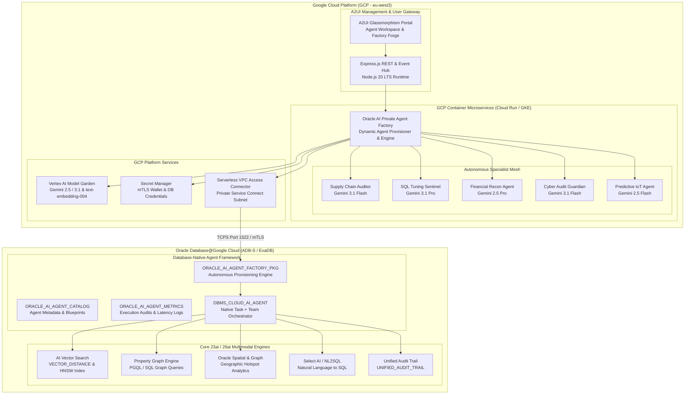

# Oracle AI Database Agentic Framework & Private Agent Factory

An enterprise-grade, hybrid **Oracle AI Agentic Framework** and **Private Agent Factory** designed for **Oracle Database 23ai / 26ai** and **Google Cloud Platform (GCP)**. 

This platform empowers data architects and AI engineers to dynamically forge, govern, and deploy autonomous AI agents either **in-database** using native `DBMS_CLOUD_AI_AGENT` capabilities or **in GCP Containers (Cloud Run & GKE)** connected via high-speed, secure mTLS private networking to **Oracle Database@Google Cloud**.

---

## 🏛️ End-to-End Hybrid Architecture



---

## 🚀 Key Features

### 1. In-Database Private Agent Factory (`DBMS_CLOUD_AI_AGENT`)
- **Native PL/SQL Engine**: Built upon `ORACLE_AI_AGENT_FACTORY_PKG` to provision, execute, and decommission agents directly inside the database kernel.
- **Enterprise Catalog**: Persisted agent metadata, system roles, tool associations, and telemetry logs inside `ORACLE_AI_AGENT_CATALOG` and `ORACLE_AI_AGENT_METRICS`.
- **Pre-Seeded Enterprise Blueprints**:
  1. **Supply Chain Risk Auditor**: Multi-tier dependency graph traversal, shipping bottlenecks, and automated stockout relief.
  2. **SQL Tuning & Index Sentinel**: Deep execution plan analysis, HNSW/IVF vector index optimization, and SQL rewrite generation.
  3. **Financial Reconciliation & Anomaly Agent**: General ledger balance verification, statistical outlier checks, and distribution charting.
  4. **Cyber Audit & Security Guardian**: `UNIFIED_AUDIT_TRAIL` forensic inspection, privilege escalation tracking, and exfiltration scoring.
  5. **Predictive Maintenance & IoT Vector Agent**: Real-time sensor embedding comparison against historical failure vectors for remaining useful life (RUL) estimation.

### 2. Dynamic Agent Forge & Interactive Sandbox
- **No-Code / Low-Code Agent Forge**: Custom agent builder supporting dynamic tool binding, model selection (Gemini 2.5 Flash/Pro, Gemini 3.1 Flash/Pro), and deployment target assignment (`HYBRID`, `DB_NATIVE`, `GCP_CONTAINER`).
- **Interactive Sandbox Console**: Real-time execution console with step-by-step reasoning trace visualization, live status indicators, and rich visual data product rendering.
- **Instant Code & Manifest Export**:
  - One-click generation of native Oracle Database 26ai **PL/SQL packages**.
  - One-click generation of production-ready **GCP Cloud Run Knative manifests**.

### 3. KI Data Product Contract Standardization
Every agent execution guarantees strict compliance with the **Data Product Contract**:
```json
{
  "executionId": "exec-1787076907761-lujc77",
  "agentId": "supply_chain_auditor",
  "agentName": "Supply Chain Risk Auditor",
  "domain": "Oracle Supply Chain ERP",
  "deploymentTarget": "HYBRID",
  "data": "**Supply Chain Risk Assessment for SKU-500:**\n...",
  "metadata": {
    "model": "gemini-3.1-flash",
    "latencyMs": 240,
    "toolCallsCount": 4,
    "confidence": 0.98,
    "source": "Oracle Database 26ai @ GCP Container [supply_chain_auditor]",
    "timestamp": "2026-08-18T18:15:07.761Z"
  },
  "insights": "Autonomous multi-agent supply chain resolution contract verified."
}
```

### 4. GCP Containerized Deployment Suite
- **Multi-Stage Containerization (`Dockerfile`)**: Production-ready Debian/Node 20 image with Instant Client library dependencies, non-root `appuser`, and multi-probe healthchecks.
- **Cloud Run Service Manifest (`deploy/cloud-run-service.yaml`)**:
  - Serverless VPC Access Connector (`run.googleapis.com/vpc-access-connector`) for direct peering to Oracle Database@Google Cloud.
  - Secret Manager volume mounts for mTLS wallet archives (`cwallet.sso`).
  - Google Cloud Workload Identity integration (`roles/aiplatform.user` + `roles/secretmanager.secretAccessor`).
- **GKE Deployment & Autoscaler (`deploy/gke-agent-factory.yaml`)**: Production Kubernetes Deployment with ClusterIP Service and Horizontal Pod Autoscaler (HPA).
- **Automated Deployment Script (`deploy/deploy-gcp-cloudrun.sh`)**: End-to-end automated build and deployment to Google Cloud Run.

---

## 📂 Repository Structure

```text
.
├── adk/
│   ├── private-agent-factory.js     # Node.js Private Agent Factory engine & artifact generator
│   ├── agentic-factory.js           # ADK factory bridge and agent coordinator
│   └── generic-agent.js             # Base agent class enforcing Data Product Contracts
├── agents/
│   ├── coordinator-agent.js         # Multi-Agent Gateway orchestrator (CLI & Web)
│   └── specialist-agents.js         # Domain-specialist agents (Graph, Spatial, Select AI, Action)
├── deploy/
│   ├── cloud-run-service.yaml       # GCP Cloud Run Knative deployment manifest
│   ├── deploy-gcp-cloudrun.sh       # Automated Cloud Run build & deploy script
│   ├── gke-agent-factory.yaml       # GKE Kubernetes Deployment, Service & HPA manifest
│   └── README_GCP_DEPLOYMENT.md     # Detailed GCP Container deployment architecture guide
├── services/
│   ├── oracle-db.js                 # Oracle connection pool, thin client, & in-db agent execution
│   └── rag-engine.js                # Vector embedding, indexing, & retrieval engine
├── sql/
│   ├── oracle_ai_private_agent_factory.sql # Native PL/SQL Agent Factory installer
│   ├── oracle_ai_database_agent.sql        # Database-native DBMS_CLOUD_AI_AGENT definitions
│   └── oracle_ai_database_agent_tool.sql   # In-database tool registration procedures
├── uix/
│   ├── index.html                   # A2UI Enterprise Web Portal (Workspace + Agent Factory)
│   ├── index.js                     # SPA State Manager, trace controller & sandbox runner
│   ├── index.css                    # Glassmorphism theme, KPI cards, and responsive grids
│   └── a2ui-components.js           # Dynamic Chart.js, SVG Graph, & Action sheet renderers
├── app.js                           # Express REST API Server & API gateway
├── Dockerfile                       # Multi-stage production container image definition
├── docker-compose.yml               # Local multi-container development environment
├── run_demo.sh                      # Interactive CLI demo runner & deployment orchestrator
└── README.md                        # Master documentation
```

---

## 🛠️ Quickstart & Local Execution

### Prerequisites
- Node.js v18+ installed.
- (Optional) Google Cloud SDK (`gcloud`) with authenticated Application Default Credentials.
- (Optional) Oracle Autonomous Database 23ai / 26ai wallet credentials.

### 1. Install Dependencies
```bash
npm install
```

### 2. Launch the Interactive Demo Runner
```bash
./run_demo.sh
```

Choose from the interactive menu:
- **Option 1**: Spin up the Unified Web Hub & A2UI Portal (`http://localhost:8080`).
- **Option 2**: Test the Private Agent Factory CLI directly in your terminal.
- **Option 3**: Run the interactive Multi-Agent Coordinator CLI session.
- **Option 4**: Run simulated direct database isolation proofs.
- **Option 6**: Deploy the Agent Factory container directly to GCP Cloud Run.

---

## 🌐 Private Agent Factory REST API Reference

| Method | Endpoint | Description |
| :--- | :--- | :--- |
| `GET` | `/api/factory/templates` | Returns all pre-seeded enterprise agent blueprints |
| `GET` | `/api/factory/agents` | Lists all active provisioned private agents |
| `POST` | `/api/factory/provision` | Forges and registers a new private agent |
| `POST` | `/api/factory/execute` | Executes an agent query with trace reasoning |
| `GET` | `/api/factory/trace` | Retrieves active execution reasoning trail |
| `GET` | `/api/factory/export/plsql/:id` | Generates Oracle 26ai native PL/SQL installer script |
| `GET` | `/api/factory/export/gcp-manifest/:id` | Generates GCP Cloud Run Knative deployment YAML |
| `GET` | `/api/factory/gcp/status` | Returns GCP container runtime diagnostics |
| `GET` | `/api/v1/health` | Service health status probe |

---

## ☁️ Deploying to Google Cloud Run

To deploy the Private Agent Factory to GCP Cloud Run in region `eu-west3`:

```bash
# 1. Set environment variables
export GCP_PROJECT_ID="total-vertex-469513-r8"
export GCP_REGION="eu-west3"

# 2. Run automated deployer
bash deploy/deploy-gcp-cloudrun.sh
```

For custom configurations, secret volume mounts, and GKE instructions, see [deploy/README_GCP_DEPLOYMENT.md](file:///Users/jdumitru/Projects/oracle_ai_agentic_demo/deploy/README_GCP_DEPLOYMENT.md).

---

## 📄 License
Internal Demo & Reference Architecture for Oracle Database & Google Cloud Platform integrations.

