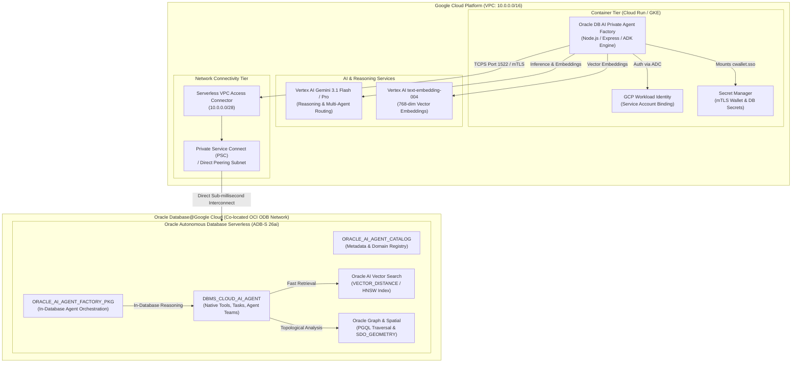

# 🏛️ Oracle AI Private Agent Factory & Agentic Framework
## Enterprise GCP Container Deployment Architecture & Runbook

> **Target Architecture:** Oracle Database 23ai / 26ai (Oracle Database@Google Cloud) + GCP Cloud Run / GKE Containers + Vertex AI Gemini  
> **Security Model:** Zero-Trust Private VPC Peering, TCPS 1522 mTLS Client Wallets, GCP Secret Manager, IAM Workload Identity  

---

## 1. Architectural Blueprint



---

## 2. Key Pillars of the Private Agent Factory

### 🔹 1. In-Database Native Agent Execution (`DBMS_CLOUD_AI_AGENT`)
- **Zero Data Outflow**: Queries, vector comparisons, and metadata evaluations execute directly inside the Oracle DB memory space.
- **Fail-safe SQL & Range Self-Correction**: When an LLM-generated SQL statement encounters predicate or boundary errors, the in-database agent autonomously executes `RANGE_VALUES_CHECK` or `DISTINCT_VALUES_CHECK` to refine parameters.
- **Declarative Blueprints**: Teams, Agents, and Tasks are managed via `ORACLE_AI_AGENT_FACTORY_PKG`.

### 🔹 2. Containerized Dynamic Agent Factory (GCP Cloud Run / GKE)
- **Dynamic Hot-Swapping**: Provision custom private agents on the fly with specialized LLM models (Gemini 2.5 Flash, Gemini 3.1 Flash, Gemini 3.1 Pro) without redeploying code.
- **KI Data Product Contract Compliance**: Every agent response is encapsulated in a validated metadata contract with confidence scores, execution latency, and source lineage.
- **Elastic Scale-to-Zero**: Cloud Run automatically scales from 0 instances during quiet hours up to 20+ concurrent containers during high-demand multi-agent analytics bursts.

### 🔹 3. Enterprise Zero-Trust Security
- **No Static Service Account Keys**: Authenticates with Vertex AI via **GCP Workload Identity**.
- **Hardware-Level Encryption**: Mutual TLS (mTLS) over **TCPS Port 1522** with auto-login wallets (`cwallet.sso`).
- **Private Network Isolation**: Container egress is strictly routed through a **Serverless VPC Access Connector** directly into the Oracle Database@Google Cloud delegated client subnet.

---

## 3. Step-by-Step Deployment Runbook

### Step 1: Prepare Oracle Database Schema & Package
Connect to your Oracle Autonomous Database 23ai / 26ai as `ADMIN` and run:

```bash
sqlplus admin@adbs_high @sql/oracle_ai_private_agent_factory.sql
```

This creates the tables (`ORACLE_AI_AGENT_CATALOG`, `ORACLE_AI_AGENT_METRICS`) and registers the 5 core enterprise blueprints.

### Step 2: Store Connection Wallet in GCP Secret Manager
```bash
# Upload Oracle connection wallet zip to GCP Secret Manager
gcloud secrets create oracle-db-wallet-zip \
    --data-file=./.oracle_wallet/wallet.zip \
    --replication-policy="automatic" \
    --project="${GCP_PROJECT_ID}"
```

### Step 3: Build & Deploy Container to Cloud Run
Run the automated deployment script:
```bash
chmod +x deploy/deploy-gcp-cloudrun.sh
./deploy/deploy-gcp-cloudrun.sh
```

### Step 4: Verify Deployment Health & Active Agents
```bash
# Check container health
curl -s https://<YOUR-CLOUD-RUN-URL>/api/v1/health | jq .

# Inspect active private agent fleet
curl -s https://<YOUR-CLOUD-RUN-URL>/api/factory/agents | jq .

# Execute prompt on Supply Chain Risk Auditor
curl -X POST https://<YOUR-CLOUD-RUN-URL>/api/factory/execute \
    -H "Content-Type: application/json" \
    -d '{
      "agentId": "supply_chain_auditor",
      "prompt": "What inventory action should we take for SKU-500?"
    }' | jq .
```

---

## 4. Pre-Packaged Enterprise Agent Blueprints

| Blueprint ID | Name | Domain Scope | Primary Tools | Execution Target |
| :--- | :--- | :--- | :--- | :--- |
| `supply_chain_auditor` | Supply Chain Risk Auditor | Supply Chain ERP | Graph, Spatial, SQL, Action Dispatch | Hybrid (Container + DB) |
| `sql_tuning_sentinel` | SQL Tuning & Index Sentinel | Database Diagnostics | Plan Tables, Vector Index DDL | Database-Native |
| `financial_recon_agent` | Financial Reconciliation Agent | General Ledger | SQL, Distinct Checks, Charting | GCP Container |
| `cyber_audit_guardian` | Cyber Threat & Audit Guardian | Unified Audit | Audit Trail, Exfiltration Scorer | Hybrid |
| `predictive_maintenance_agent` | Predictive IoT Maintenance | Asset Management | Vector Search (RAG_TAB), Charts | Hybrid |
