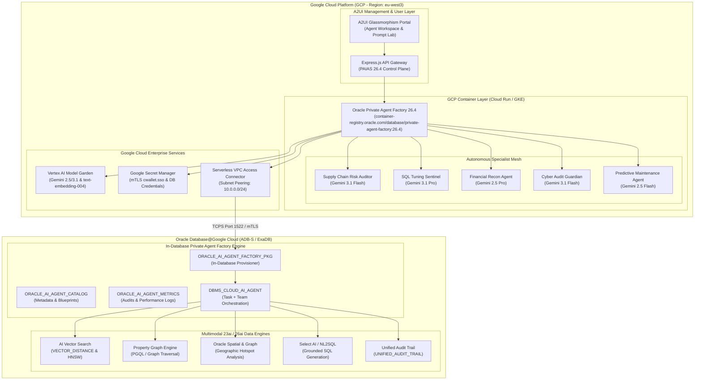

# 🏛️ Oracle AI Database Private Agent Factory (PAIAS 26.4) Integration & GCP Deployment Guide

This comprehensive technical guide outlines the architecture, container image setup, and deployment of **Oracle AI Database Private Agent Factory (PAIAS 26.4)** on **Google Cloud Platform (GCP)** connecting to **Oracle Database@Google Cloud (ADB-S / ExaDB)**.

---

## 📚 Official Reference Links

- **📖 Official Documentation (PAIAS 26.4)**: [Oracle Agent Factory User's Guide (Release 26.4)](https://docs.oracle.com/en/database/oracle/agent-factory/26.4/paias/)
- **📦 Official Container Downloads**: [Oracle AI Database Private Agent Factory Downloads](https://www.oracle.com/database/technologies/private-agent-factory-downloads.html)
- **🌐 Oracle Container Registry (OCR)**: `container-registry.oracle.com/database/private-agent-factory:26.4`

---

## 🏛️ Hybrid System Architecture



---

## 🚀 What is Oracle AI Database Private Agent Factory (PAIAS 26.4)?

**Oracle AI Database Private Agent Factory (Release 26.4)** provides an end-to-end, enterprise-governed platform for creating, testing, deploying, and monitoring private AI agents grounded directly on Oracle Database 23ai / 26ai data assets and cloud LLM engines.

### Key Capabilities in 26.4:
1. **Interactive Prompt Lab**:
   - Few-shot prompt engineering, domain guardrail configuration, and live output validation.
2. **Pre-Built Enterprise Blueprints**:
   - Pre-configured, domain-specialized agent templates for Supply Chain, SQL Tuning, Financial Reconciliation, Cyber Auditing, and IoT Predictive Maintenance.
3. **Dual Execution Architecture**:
   - **In-Database Native**: Executes via `DBMS_CLOUD_AI_AGENT` and `ORACLE_AI_AGENT_FACTORY_PKG` inside Oracle Database.
   - **GCP Containerized**: Executes as a microservice on Cloud Run / GKE with VPC Access and Secret Manager mTLS wallet mounting.
4. **Tool & Action Binding**:
   - Dynamic binding of SQL Tools, Graph Traversal, Spatial Analytics, Vector Search, and Action Dispatchers.
5. **Zero-Trust Exfiltration Governance**:
   - Strict data masking, private virtual network isolation, and unified audit trail logging.
6. **KI Data Product Contract Standardization**:
   - Guaranteed JSON output schema: `{ domain, data, metadata: { model, latencyMs, toolCallsCount, confidence, source, timestamp }, insights }`.

---

## 📥 Container Image Acquisition & Setup Runbook

Oracle distributes Private Agent Factory 26.4 container images through two primary channels:
1. **Oracle Container Registry (OCR)**: `container-registry.oracle.com/database/private-agent-factory:26.4`
2. **Oracle Technology Network (OTN) / Software Delivery Cloud Downloads**: [Download Page](https://www.oracle.com/database/technologies/private-agent-factory-downloads.html)

### Automated Setup Script
We provide an automated setup script: [`deploy/setup-oracle-paf-images.sh`](file:///Users/jdumitru/Projects/oracle_ai_agentic_demo/deploy/setup-oracle-paf-images.sh).

```bash
# Run the automated acquisition & GCP staging script
bash deploy/setup-oracle-paf-images.sh
```

---

### Step-by-Step Manual Image Acquisition

#### Option A: Pull Directly from Oracle Container Registry (OCR)
1. Navigate to [https://container-registry.oracle.com](https://container-registry.oracle.com), log in with your Oracle SSO, and accept the standard terms for **Database > private-agent-factory**.
2. Authenticate Docker with OCR:
   ```bash
   docker login container-registry.oracle.com -u <oracle_sso_email>
   ```
3. Pull the official 26.4 container image:
   ```bash
   docker pull container-registry.oracle.com/database/private-agent-factory:26.4
   ```
4. Tag and push to Google Container Registry (GCR) or Google Artifact Registry:
   ```bash
   # Tag for GCP
   docker tag container-registry.oracle.com/database/private-agent-factory:26.4 \
     gcr.io/${GCP_PROJECT_ID}/oracle-private-agent-factory:26.4

   # Authenticate gcloud & push
   gcloud auth configure-docker --quiet
   docker push gcr.io/${GCP_PROJECT_ID}/oracle-private-agent-factory:26.4
   ```

---

#### Option B: Load from Downloaded OTN Archive
1. Download `private-agent-factory-26.4-container.tar.gz` from the [Oracle Downloads Page](https://www.oracle.com/database/technologies/private-agent-factory-downloads.html).
2. Load the archive into Docker:
   ```bash
   docker load -i private-agent-factory-26.4-container.tar.gz
   ```
3. Tag and push to Google Cloud:
   ```bash
   docker tag oracle/private-agent-factory:26.4 \
     gcr.io/${GCP_PROJECT_ID}/oracle-private-agent-factory:26.4
   docker push gcr.io/${GCP_PROJECT_ID}/oracle-private-agent-factory:26.4
   ```

---

## ☁️ Google Cloud Platform Deployment

### 1. Cloud Run Deployment (`deploy/cloud-run-paf-26.4.yaml`)

Google Cloud Run provides serverless autoscaling (0 to 10 instances) for the container image:

```yaml
apiVersion: serving.knative.dev/v1
kind: Service
metadata:
  name: oracle-paf-26-4
  annotations:
    run.googleapis.com/vpc-access-connector: projects/total-vertex-469513-r8/locations/eu-west3/connectors/oracle-db-connector
    run.googleapis.com/vpc-access-egress: all-traffic
spec:
  template:
    spec:
      serviceAccountName: oracle-agent-factory-sa@total-vertex-469513-r8.iam.gserviceaccount.com
      containers:
      - image: gcr.io/total-vertex-469513-r8/oracle-private-agent-factory:26.4
        env:
        - name: PAIAS_VERSION
          value: "26.4"
        - name: GCP_PROJECT_ID
          value: "total-vertex-469513-r8"
        - name: GCP_REGION
          value: "eu-west3"
        - name: TNS_ADMIN
          value: "/secrets/oracle-wallet"
        volumeMounts:
        - name: oracle-wallet-volume
          mountPath: /secrets/oracle-wallet
          readOnly: true
```

Deploy via CLI:
```bash
gcloud run services replace deploy/cloud-run-paf-26.4.yaml --region=eu-west3
```

---

### 2. GKE Deployment (`deploy/gke-paf-26.4.yaml`)

For Kubernetes-managed private container clusters:
```bash
kubectl apply -f deploy/gke-paf-26.4.yaml
```

---

### 3. Local Docker Compose (`deploy/docker-compose-paf-26.4.yml`)

For local development or air-gapped container testing:
```bash
docker-compose -f deploy/docker-compose-paf-26.4.yml up -d
```

---

## 🔍 In-Database Private Agent Factory Setup (SQL)

To initialize the in-database Private Agent Factory catalog and package in Oracle Database 23ai / 26ai:

1. Connect to your Autonomous Database as `ADMIN` using SQLcl or SQL*Plus:
   ```bash
   sql admin/Welcome12345#@adbs_high
   ```
2. Execute the installer script:
   ```sql
   @sql/oracle_ai_private_agent_factory.sql
   ```
3. Test native agent execution:
   ```sql
   SET SERVEROUTPUT ON;
   DECLARE
       v_res CLOB;
   BEGIN
       v_res := ORACLE_AI_AGENT_FACTORY_PKG.execute_private_agent(
           p_agent_id => 'supply_chain_auditor',
           p_prompt   => 'What inventory action should we take for SKU-500?'
       );
       DBMS_OUTPUT.PUT_LINE(v_res);
   END;
   /
   ```

---

## 📊 Summary of Manifests & Scripts

| File | Purpose |
| :--- | :--- |
| [`deploy/setup-oracle-paf-images.sh`](file:///Users/jdumitru/Projects/oracle_ai_agentic_demo/deploy/setup-oracle-paf-images.sh) | Automated OCR pull, OTN archive load, and GCP Artifact Registry push script |
| [`deploy/cloud-run-paf-26.4.yaml`](file:///Users/jdumitru/Projects/oracle_ai_agentic_demo/deploy/cloud-run-paf-26.4.yaml) | Cloud Run Knative manifest for PAIAS 26.4 with mTLS wallet volume mounts |
| [`deploy/gke-paf-26.4.yaml`](file:///Users/jdumitru/Projects/oracle_ai_agentic_demo/deploy/gke-paf-26.4.yaml) | GKE Deployment, Service, and HPA manifest for PAIAS 26.4 |
| [`deploy/docker-compose-paf-26.4.yml`](file:///Users/jdumitru/Projects/oracle_ai_agentic_demo/deploy/docker-compose-paf-26.4.yml) | Local multi-container Docker Compose configuration |
| [`sql/oracle_ai_private_agent_factory.sql`](file:///Users/jdumitru/Projects/oracle_ai_agentic_demo/sql/oracle_ai_private_agent_factory.sql) | Native PL/SQL Agent Factory engine (`ORACLE_AI_AGENT_FACTORY_PKG`) |
| [`adk/private-agent-factory.js`](file:///Users/jdumitru/Projects/oracle_ai_agentic_demo/adk/private-agent-factory.js) | Dynamic Agent Factory engine, prompt lab, and code generator |
| [`run_demo.sh`](file:///Users/jdumitru/Projects/oracle_ai_agentic_demo/run_demo.sh) | Interactive demo runner with image setup and Cloud Run deployment options |
